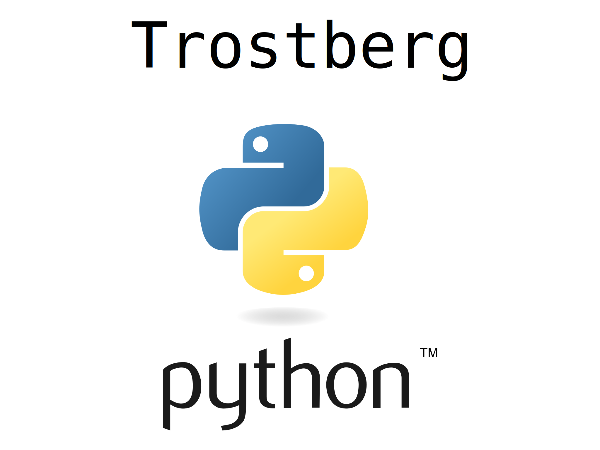

# trostberg-python

Hey Nachbar!

Ich suche Python-Programmierer für regelmäßige Offline-Treffen in meiner Nacchbarschaft.

Konferenzen: Sozusagen kleine "Python-Konferenzen" mit "Pair-Programming" und so...
also auch "Anfänger" dürfen gerne kommen - Learning by doing!
(Wir brauchen allgemein mehr Privatlehrer, nicht nur für Python...)

Geschmack: Ich glaube, Python ist ein Ausdruck von Eleganz, Effizienz, Kompaktheit, ...
also ich glaube, wer vor allem in Python programmiert, der hat "einen guten Geschmack".

Java Diss: ... im Gegensatz zu etwa Java-Programmierern,
die einfach nur hängengeblieben sind auf einem "Industrie Standard" von vor 20 Jahren,
weil "das bringt Geld", aber Java ist nicht schön, nicht effizient, nicht kompakt...

Native Performance: Wer wirklich "native Performance" braucht,
der schreibt seine Programme heute in Rust oder Zig,
und macht dafür ein Python-Binding für den high-level code.

KI: Ich glaube nicht, dass die Künstliche Intelligenz uns Programmierer komplett ersetzen wird.
Ich glaube, die Künstliche Intelligenz liefert immer bessere Vorschläge,
aber am Schluss braucht man immer noch Menschen für die "Qualitätskontrolle",
und wer effizient mit einer KI arbeiten will (GitHub Copilot, ChatGPT, DeepSeek, EnochAI, ...)
der muss erstmal die Programmiersprache verstehen, also Erfahrung sammeln beim Programmieren,
und das dauert Monate oder Jahre.

Gehirn Jogging: Ich glaube, Programmieren ist eine extrem nütliche Form von "Gehirn Jogging",
also Programmieren ist sehr hilfreich, wenn man "geistig fit" bleiben will,
weil Programmieren bietet extrem kurze "Feedback Loops",
also man sieht innerhalb von Sekunden (oder noch schneller)
ob ein Programm "richtig" oder "falsch" ist (Schwarz/Weiss-Denken, Boolesche Logik)...
und damit trainiert man die generische "Feedback Loop" in seinem Gehirn,
also das häufige "Hin und Her"
zwischen "passiv einen Zustand beobachten und analysieren"
und "aktiv einen Zustand verändern und verbessern".

Grundwissen: ... also ich glaube, jeder sollte Programmieren lernen!
Ähnlich wie Schuhe-Binden oder "ein Butterbrot schmieren" oder "Spiegeleier braten"
sollte "Computer Programmieren" zum absoluten Grundwissen für alle Menschen gehören,
das Kinder schon in der Grundschule lernen sollen, gleich in der ersten Klasse,
dann lernen sie ja automatisch Lesen, Schreiben, Rechnen --
Weil genau das ist Programmieren ja auch: Lesen, Schreiben, Rechnen.

Arbeit: Es gibt soo viele Projekte und Ideen die Programmierer brauchen...
also "sinnvolle Arbeit" für Programmierer wird nie ausgehen.
Ich selber kann wahrscheinlich locker 10 Leute "beschäftigen" mit meinen Projekten und Ideen...
Und wir können ja "Peer To Peer" Trading machen, also "Arbeiten für Geld"...

Repo: Ich hab uns ein GitHub-Repo gemacht:
https://github.com/milahu/trostberg-python

Genug gelabert! Lasst uns treffen : )
